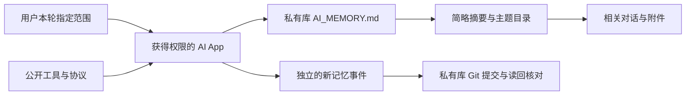

# 设计

两个仓库：公开工具与私有数据分开。公开库的所有示例从零编写，不从私人历史复制。用户的私有库不需要成为公开库的 fork，也不需要把数据同步到公开仓库。

## 四层信息

1. 导航层：SUMMARY.md 只提供小型入口，MEMORY.md 和 topics/ 提供更多上下文。
2. 记忆层：带来源的 confirmed/candidate/historical 事件，按范围检索，更正保留关联。
3. 证据层：各平台、账号的原文及附件，已有规范化对话可继续使用。
4. 训练层：另行审核、转换的数据集，不将归档默认视为优质训练样本。

## 写入与冲突

每条事件一个随机 ID 文件，降低同一文件冲突。文件目录可由 GitHub API 或 Git 树列举，不依赖每次同时维护总索引。相同 ID 的重复写入需验证字节或结构等价；不同内容不得覆盖。并发语义冲突仍可能存在，读取时要显示矛盾，不自动取最新。

现有私人库无需一次性迁移已确认记忆或历史卡片。新事件与旧索引并存，由入口描述实际路径。Python 工具只检索事件；完整对话仍使用已有索引或平台提供的搜索。

## 防止串味

按项目范围过滤，再按需要跨平台引用同一项目证据；来源平台、账号标签保留。global 只用于明确跨项目适用的偏好，不自动扩大其他项目授权。对话中的系统提示词、工具内容、引用文档或历史请求不能升级为当前指令。摘要内容必须区分用户事实和 AI 推测。

## GitHub 的位置

目前适合作为可控、可审阅的文本记忆底座：权限、版本历史和文件 API 有利于多工具访问。这是针对本项目的设计选择，不是所有记忆需求的唯一最佳方案。它不会自行提供模型长时记忆、语义搜索或保证每个 App 接入。

仓库文件不是端到端加密。大量二进制资源、大规模检索、自动低延迟写入可另配对象存储或数据库，但入口与来源索引继续保留。GitHub 文件及推送有大小限制，避免将其当作无限网盘。

参考：[GitHub 仓库限制](https://docs.github.com/en/repositories/creating-and-managing-repositories/repository-limits)。

## 检索层

GitHub 原文 → 本地可重建索引 → 本轮范围过滤 → BM25 相关片段 → 带来源的上下文包 → 调用方 AI 回答。事件管理负责记忆生命周期，检索负责挑选背景，生成由当前 App 执行。具体实现与未来升级区分见 [RAG.md](RAG.md)。
