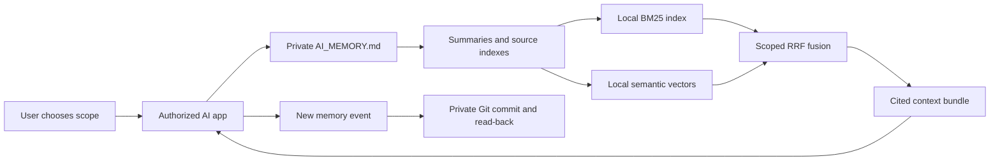

# Architecture

Separate public tooling from private evidence. Public examples are written from scratch; private archives are not copied into this project. A private memory repository does not need to fork the public toolkit.

## Memory layers

- Episodic evidence: original conversations, roles, dates, and attachments.
- Semantic memory: sourced facts and preferences, with confidence status and validity.
- Procedural memory: explicit user-confirmed workflows; historical prompts do not automatically become instructions.
- Working context: a temporary retrieval bundle constrained to the current task and budget.
- Training data: separately reviewed samples with provenance; archival text is not automatically training-quality material.

## Persistence and retrieval

GitHub provides durable files, access control, and version history. SQLite indexes are disposable derivatives, stored in private GitHub Actions caches for cloud execution, or outside the memory repository for optional local development. BM25 handles exact terms; local multilingual E5 supplies semantic candidates. RRF merges ranked lists without comparing unrelated score scales. Scope, time, lifecycle state, and source checks apply before a context is returned.

Unique event files reduce same-file contention. Retries retain their ID; corrections preserve history. Explicit claim disagreements remain unresolved until a supported correction is recorded. Derived summaries are navigation aids and may lag new events.

## Honest boundaries

No autonomous fact extractor, trained reranker, inferred graph-RAG engine, always-on hosted API, or MCP server is included. Explicit sourced relationship graphs, candidate consolidation drafts, and working checkpoints are supported by the GitHub cloud workflow. importance is metadata, not a learned salience signal. Attachment OCR and multimodal embeddings are not implemented. Nearest semantic matches may still be irrelevant; provenance and user scope do not make a retrieved statement true.

Logical forgetting prevents event recall, not physical erasure. Existing conversation files and Git history remain available unless separately redacted. Sensitive data can also remain in old local indexes and vector caches.

The design draws on retrieval-augmented generation and agent-memory work while keeping deterministic user controls. It does not claim to reproduce published benchmark results: [RAG](https://arxiv.org/abs/2005.11401), [Generative Agents](https://arxiv.org/abs/2304.03442), [A-MEM](https://arxiv.org/abs/2502.12110).

[Retrieval implementation](RAG.md) · [Lifecycle semantics](LIFECYCLE.md).
